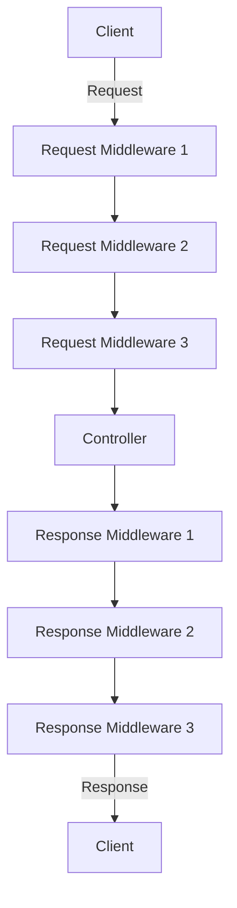

<Share colorful />

### 中间件洋葱模型

### `hyperlane` 框架版本 < `v3.0.0` 的版本

> [!tip]
> 具体生命周期如下：
>
> - 先根据注册顺序执行同步路由
> - 最后执行同步路由

### `hyperlane` 框架 >= `v3.0.0` 且 < `v4.0.0` 的版本

> [!tip]
> 具体生命周期如下：
>
> - 先根据注册顺序处理所有的异步中间件
> - 再处理所有的异步中间件，异步中间件执行能保证和代码注册顺序一致
> - 再根据注册顺序执行同步路由，如果同步路由存在则不会执行同名的异步路由
> - 最后执行异步路由

### `hyperlane` 框架 >= `v4.0.0` 的版本

> [!tip]
> 具体生命周期如下：
>
> - 先根据注册顺序处理所有的异步中间件
> - 最后根据注册顺序执行异步路由

### `hyperlane` 框架 >= `v4.22.0` 的版本

> [!tip]
> 具体生命周期如下：
>
> - 先根据注册顺序处理所有的异步请求中间件
> - 再根据注册顺序执行异步路由
> - 最后根据注册顺序处理所有的异步响应中间件

### `hyperlane` 框架 >= `v4.89.0` 的版本

> [!tip]
> 如果任一环节调用`ctx.aborted().await` 则会中止后续流程

<Bottom />
