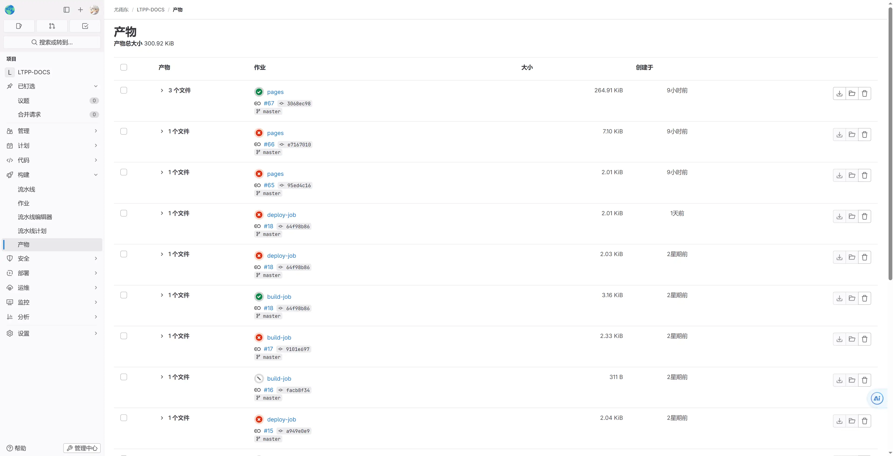

<Share colorful />

[系统地址](https://git.ltpp.vip)

## 功能

GITLAB 仓库基于 GITLAB 部署支持以下功能

- 代码仓库
- CI/CD
- PAGES
- 镜像库
- 邮件
- 监控

## 界面

### 首页

### 全局搜索

### 新建项目

### 用户主页

### 项目主页

### 项目分析

### CI/CD

### PAGES

### 个人设置

### 邮件通知

<Bottom />
