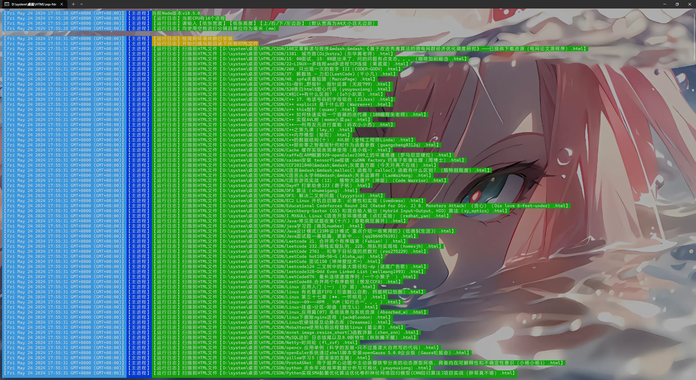

[GITHUB 地址](https://github.com/ltpp-universe/HTML-PDF)

[LTPP-GIT 地址](https://jihulab.com/ltpp-universe/html-pdf)

<Share colorful />
<Catalog />

## 功能

> [!tip]
> 工具 `LTPP` 批量 `HTML` 转 `PDF` 支持将当前目录下所有 `HTML` 文件转成 `PDF` 文件，并且在新目录中保存文件结构与原目录结构一致

## 说明

> [!tip]
> 一共两个独立版本，`html-pdf` 目录下是基于 `html-pdf` 模块开发的应用，`puppeteer` 目录下是基于 `puppeteer` 模块开发的应用

## 安装

> [!tip]
> npm i

## 运行

> [!tip]
>
> - 1.对于 `html-pdf`，双击 `exe` 文件运行（仅适用于 `win-x64`）
> - 2.对于 `puppeteer`，由于打包后 `exe` 过大无法上传 `git` 仓库，请用户自行根据下面的打包方法进行打包
> - 2.如果系统有 `node` 环境并且安装了 `npm`，可以使用命令 `npm run start` 直接运行

### 针对 puppeteer 进行打包（对于 html-pdf 开发的应用，由于 pkg 对于可执行文件的限制策略暂时不可用，puppeteer 可以使用下面的命令打包）

> [!tip]
> 打包时间可能很久请耐心等待，因为需要打包的资源很大并且进行压缩处理，时间消耗较多

> - 1.首次打包需要运行以下命令 `npm run install-pkg`
> - 2.解压 `chrome.7z`
> - 3.运行打包命令，会在项目根目录生成 `exe` 可执行文件 `npm run pkg`

## 使用说明

> [!tip]
>
> - 使用多进程将 `HTML` 转成 `PDF`
> - 递归自动扫描项目下的所有目录获取所有 `HTML` 文件
> - `PDF` 目录（系统会自动创建）存储转换后的 `PDF` 文件（`PDF` 存储位置根据获取的 `HTML` 目录相对位置递归创建文件夹存储 `PDF` 文件，保证和原来目录结构相同）
> - 如果 `PDF` 重复会覆盖旧的内容
> - 对于基于 `puppeteer` 开发的应用，添加环境自动检测和修复功能

### 批量转换

### 转换结果

<Bottom />
