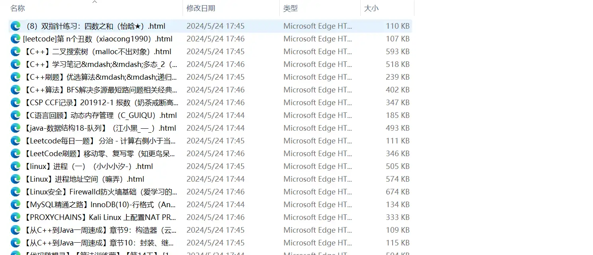

<Share colorful />
<Catalog />

[GITHUB 地址](https://github.com/ltpp-universe/RUST-WEB-SERVE)

## 功能

LTPP 爬虫工具支持以下功能

- 爬取`知乎`，`简书`，`CSDN` 文章
- 支持 `HTML` 文件本地保存
- 支持数据库保存
- 支持选择爬取站点
- 支持爬取进程数目设置
- 支持 `Node` 和 `PHP` 两种语言版本

## 说明

- 数据库确保创建
- 未创建指定数据库运行时根据提示输入【不保存到数据库】和【保存到本地文件】对应序号即可
- `JS` 版本不在提供维护，只维护 `PHP` 版本
- `PHP` 需要安装和启用 `Swoole` 插件

<Bottom />
