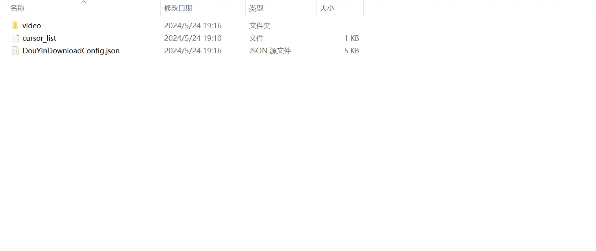

[GITHUB 地址](https://github.com/ltpp-universe/sqs-douyin-collection-download)

<Share colorful />
<Catalog />

## 功能

LTPP-抖音收藏下载工具支持以下功能

- 抖音收藏视频批量下载
- 支持数据库保存
- 支持下载进度缓存
- 支持设置最大下载视频个数

> [!tip]
> 抖音收藏视频批量爬取工具，支持 `win(64-bit)`，`inux(64-bit)`，`mac(64-bit)`

## 开箱即用

- win:双击 sqs-douyin-collection-download.exe 运行
- linux:输入 chmod 555 ./sqs-douyin-collection-download;./sqs-douyin-collection-download.exe;回车运行

## 使用说明

- 如果需要打包请先解压 node.7z 到当前目录，然后依次运行

  - cnpm i
  - cnpm run install-pkg
  - linux 系统运行 cnpm run pkg-linux
  - windows 系统运行 cnpm run pkg-win
  - macos 系统运行 cnpm run pkg-mac

  打包后会生成可执行文件在项目根目录

- 首次运行根据提示找到配置文件 config.json，填写配置文件里的 cookie

- config.json 配置文件详情

| 配置 key                     | 配置 value                                       | 是否必选 | 默认值        |
| ---------------------------- | ------------------------------------------------ | -------- | ------------- |
| db_host                      | 数据库地址                                       | 否       | 127.0.0.1     |
| db_username                  | 数据库用户名                                     | 否       |               |
| db_password                  | 数据库密码                                       | 否       |               |
| db_port                      | 数据库端口                                       | 否       |               |
| db_database                  | 数据库名称                                       | 否       |               |
| cookie                       | 抖音 cookie                                      | 是       |               |
| save_sql_path                | 保存的 SQL 文件路径                              | 否       | ./video.db    |
| save_progress_path           | 进度缓存文件路径                                 | 是       | ./progress    |
| save_path                    | 视频保存文件夹路径                               | 是       | ./抖音下载/   |
| save_cursor_list_path        | 已缓存列表文件路径                               | 是       | ./cursor_list |
| download                     | 是否下载视频                                     | 否       | true          |
| updatedatabase               | 是否保存数据库                                   | 否       | false         |
| update_list_length_limit     | 爬取视频最大个数                                 | 否       | 1000          |
| max_no_update_time_to_delete | 数据库 time 字段超过该时间删除记录（单位：分钟） | 否       | 30            |

> [!tip]
> PS:如果 updatedatabase 设置成 true，请填写 db_host，db_username，db_password，db_port，db_database

### 配置


```json
{
  "db_host": "ltpp.vip",
  "db_username": "root",
  "db_password": "LTPP",
  "db_port": 60002,
  "db_database": "ltpp",
  "cookie": "",
  "save_sql_path": "/video.db",
  "save_progress_path": "/progress",
  "save_path": "/video/",
  "save_cursor_list_path": "/cursor_list",
  "download": true,
  "updatedatabase": false,
  "update_list_length_limit": 1000,
  "max_no_update_time_to_delete": 30
}
```

### 目录结构



<Bottom />
