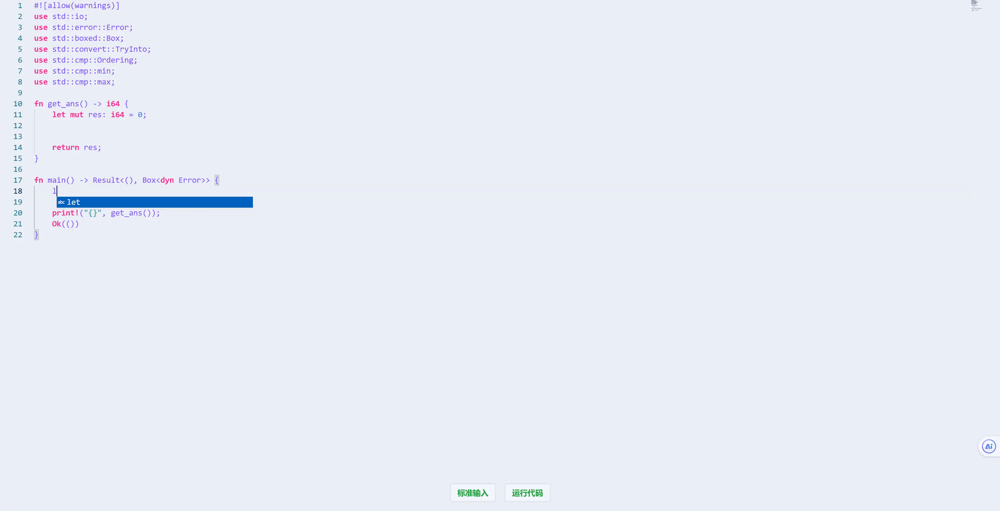

<Share colorful />

## 后端文档

[后端文档](../LTPP-CODE-RUN/README.md)

## 功能

LTPP 在线 WEB 编辑器支持以下功能

- 多种编程语言（C、C++、JS、TS、Go、Rust、PHP、JAVA、Ruby、Python3、C#、Ruby）
- 根据系统主题自动切换主题
- 支持编译错误和运行错误等详情信息的显示
- 支持输出显示

## 使用

- 标准输入快捷键：F1-F12 中（除去 F1，F5）
- 运行快捷键：F5

[LTPP-WEB-IDE C 语言地址](https://ide.ltpp.vip/?language=c)

[LTPP-WEB-IDE C++语言地址](https://ide.ltpp.vip/?language=cpp)

[LTPP-WEB-IDE JavaScript 语言地址](https://ide.ltpp.vip/?language=javascript)

[LTPP-WEB-IDE TypeScript 语言地址](https://ide.ltpp.vip/?language=typescript)

[LTPP-WEB-IDE Rust 语言地址](https://ide.ltpp.vip/?language=rust)

[LTPP-WEB-IDE Golang 语言地址](https://ide.ltpp.vip/?language=golang)

[LTPP-WEB-IDE PHP](https://ide.ltpp.vip/?language=php)

[LTPP-WEB-IDE Ruby 语言地址](https://ide.ltpp.vip/?language=ruby)

[LTPP-WEB-IDE Python3](https://ide.ltpp.vip/?language=python3)

[LTPP-WEB-IDE Java 语言地址](https://ide.ltpp.vip/?language=java)

[LTPP-WEB-IDE C#语言地址](https://ide.ltpp.vip/?language=csharp)

## 在线运行（编译/运行错误）

## 标准输入

## 正常运行

## 暗色主题

<Bottom />
