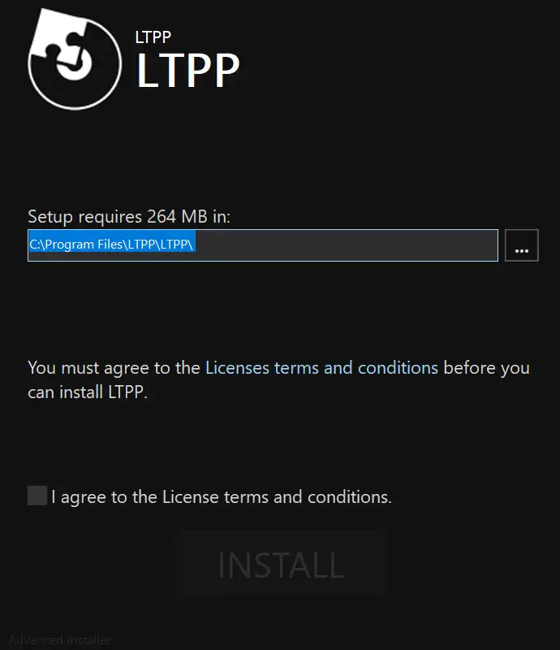
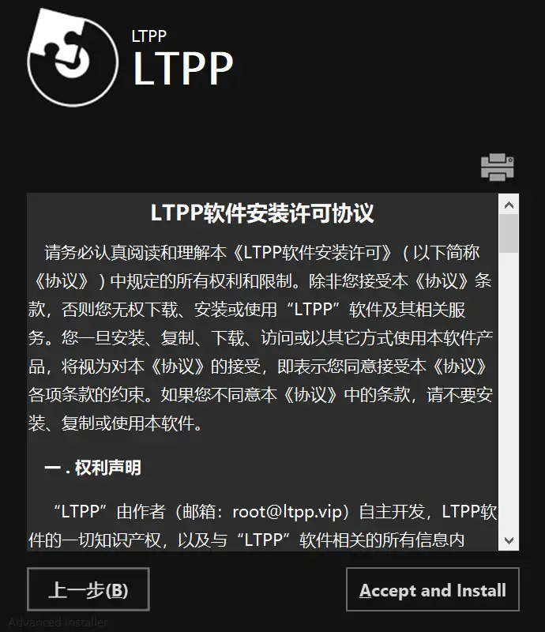
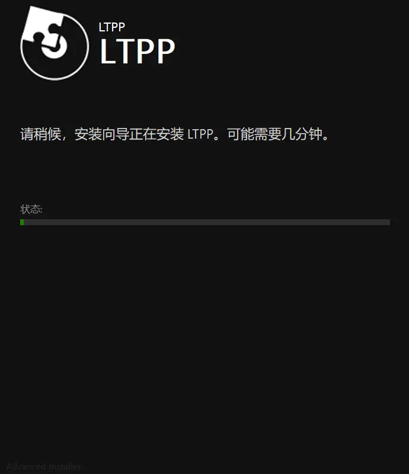
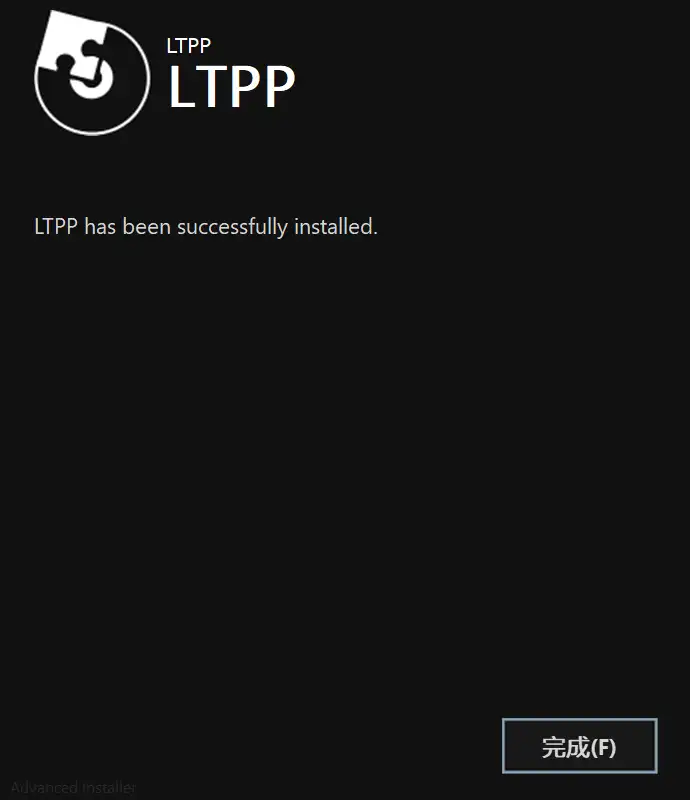
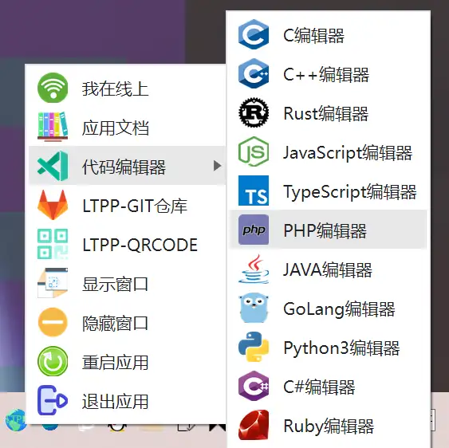
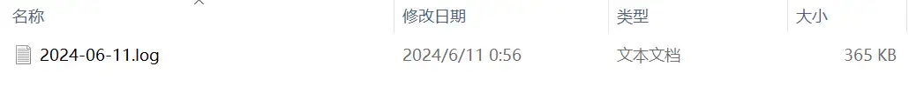

<Share colorful />

## 简介

> [!tip]
> 客户端使用 Electron 和 Tauri 框架完成开发
>
> 后续将不在维护 Tauri 版本
>
> 主力维护 Electron 版本
> [安装包下载地址](https://www.alipan.com/s/vQTYUkyCCbC)

### Electron

### Tauri

## 安装

双击运行安装

### 安装界面

### 隐私协议

### 安装

### 安装完成

安装完成后在桌面可以看到安装后的启动图标

### 系统托盘

### 日志

> [!tip]
> 日志在安装目录根目录的 `/LTPP/logs` 文件夹下
>
> - `logs` 目录为运行信息目录
>
> - `error` 目录为错误日志目录

<Bottom />
