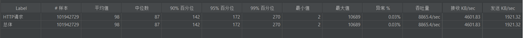
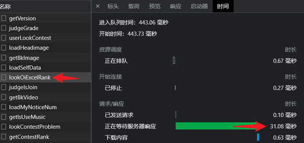
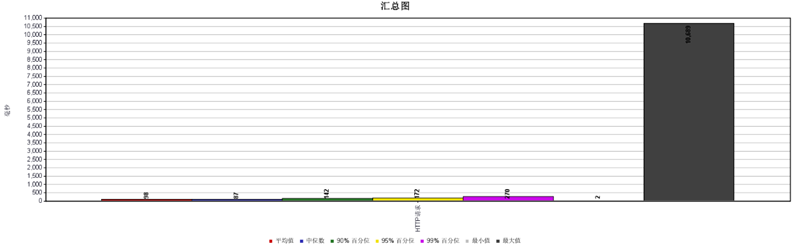
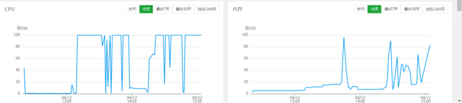
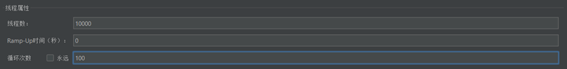
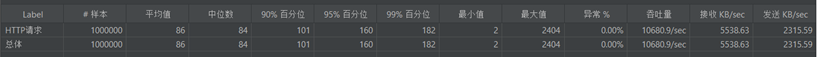
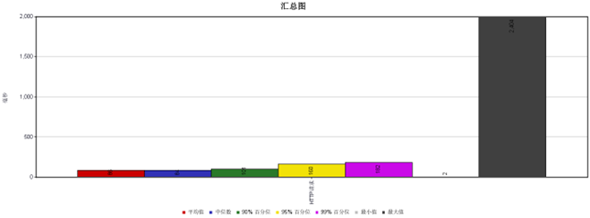

`测试服务器配置：CPU（E5-2650V2），内存（128G DDR3），硬盘（NVME协议1TB固态），带宽（100Mbps）`

`测试主机配置：CPU（AMD R7-4800H），内存（16G DDR4），硬盘（1TB固态），带宽（100Mbps）`

`测试软件：Apache JMeter`

由于判题请求比较耗费服务器资源（因为要进行进程的创建以及 `OI` 操作），
为了不限制判题并发数目，暂时将最大并发判题数目设置成 `10000（比测试的并发量` `10000` 大即可），
以下为 `10000` 并发的判题请求，可以看出 `10000` 并发的竞赛请求有百分之 `6.13` 失败，
即 `10000` 个并发请求有 `613` 个请求失败，结果较为理想。

对于一场竞赛排名的请求，从发起请求开始计时到获取到结果停止计时，一次请求后端逻辑运算花费 `31.08` 毫秒，数据下载花费 `0.63` 毫秒，一共耗时 `32.75` 毫秒，分析得出后端处理速度极快，响应速度极快的结果。

模拟用户提交代码并运行（由于代码需要进行运行，所以更消耗 `CPU` 和 `内存`），`10000` 并发，一共 `101942729` 个请求，成功率高达 99.97%。

服务器 `5000` 并发的判题情况下的负载情况（期间 `CPU` 满载运行，内存占用逐步提升到 `90%`，即 5000 并发的判题消耗内存 102.4GB）。

对于普通页面的数据获取，服务器消耗较低，经过 `10000` 并发的测试，一共 `1000000` 次请求，数据全部获取成功，没有失败的结果。

<Bottom />
